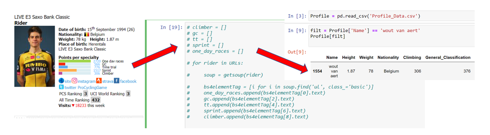

Professional Cycling Outcome Prediction Project 
======================

#### This research project uses publicly available data from https://www.procyclingstats.com/ 

## Data Collection (Web Scraping)

As this was my first project of this kind I needed to find an effective way of extracting data off ProCyclingStats.com and storing it in a format ready for analysis. I highly rate Corey Schafer's YouTube channel for learning Python, fortunetly he has a video tuturial on webscraping with BeuatifulSoup and Requests libraries, which I used along with BeuatifulSoup library documentation by crummy.com.

I wrote a script that runs through thousands race results and rider profile website pages and writes the relavent statistics (e.g. date, distance, average speed, top-10 wins etc.) to csv files.

  
Click to expand!

  
  

## Data Preperation 

Data for some variables contain unwanted characters such as 'kg' for weight and 'm' for height. Some data is missing completly, if I recall correctly, the variables that were missing the most data were rider age and 'course profile' (race hilliness). For age, missing data were replaced with average height of all the riders. For course profile, missing data were replaced with course profile average for that race (i.e Paris Roubaix). 

Feature to be included in the furture: 
1) Rider form: has the rider improved from last season?
2) Weather: particular wind because air resistance plays a major role in the outcome of bike races.
3) Team mates: does the rider have support from team mates in the race and how strong/experienced are their team mates.
4) Home nation race: does racing in your home country offer any performance advantage

## Explore the Data

The most obvious charaterrist of the data is how right swewd is. I imagine that is very commmon in sport of this kind 

## Train the Model

Visualizations

## Evaluate the Model

Visualizations

## Make Prediction

The data includes ten seasons with the most recent data being for 2020. Since then, prestidgous bikes races have been ridden namley the 'spring classics'. This offers a good oppertunity to measure my model up against.

